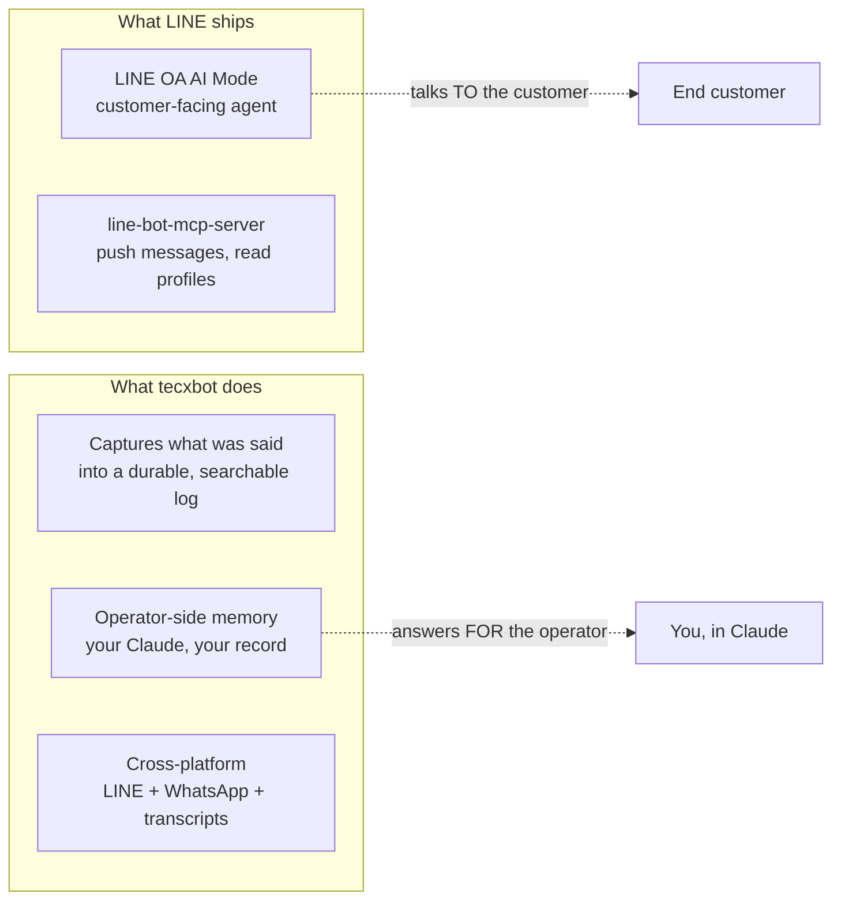
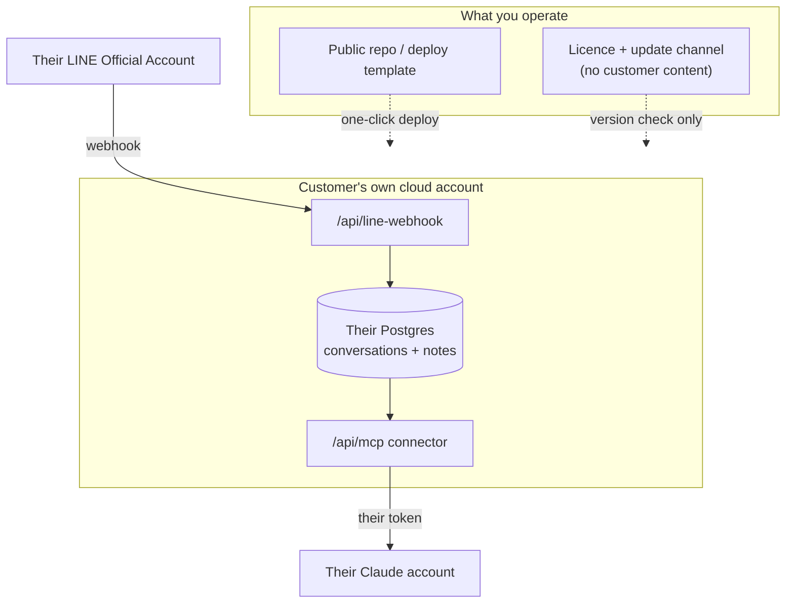
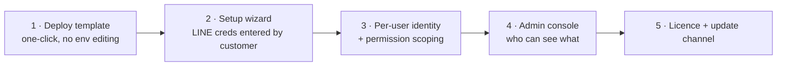

# Commercialising the Claude ↔ LINE bridge

A decision memo: the customer-deployed architecture, what it takes to match the
Claude ↔ Slack integration, Taiwan's data law, and an honest read on whether
this is a bridge worth building.

Written September 2026. Every claim about LINE's roadmap and Taiwan's PDPA is
sourced at the bottom — check them before acting, because both are moving.

---

## 1. Lead with the uncomfortable finding

**LINE is already building this.** Not hypothetically, and not in a few years.

| What | When | Source |
| --- | --- | --- |
| `line/line-bot-mcp-server` — official MCP server | shipped, preview | LINE on GitHub |
| **LINE OA AI Mode** — businesses build AI agents on their Official Account | "around summer 2026" | LY Corporation |
| **Agent i Biz** — end-to-end AI agent for business | August 2026 | LY Corporation |

It is now September 2026. Those dates are behind us, not ahead.

So the honest answer to *"will LINE do this themselves at some point?"* is: **they
are doing it now.** Any plan that assumes a multi-year window is wrong.

That is not the end of the argument — but every other question in this memo has
to be answered with that fact in view, not around it.

---

## 2. What LINE is building is not what you built

The overlap is real but partial, and the difference is the whole commercial case.

Three distinctions that matter:

**LINE's MCP server is outbound.** It pushes messages and reads profiles. It does
not give an agent the conversation history. Different direction entirely.

**LINE OA AI Mode is customer-facing.** It automates the business's side of a
conversation with an end customer. tecxbot is the opposite axis: it gives *the
operator* memory of what clients said, so a human (via their own Claude) reasons
better. A shop replacing its front desk with an AI is not the same product as a
consultancy remembering what a client promised in March.

**And the structural one:** the LINE Messaging API delivers messages by webhook,
**once**. There is no endpoint to fetch conversation history after the fact. So
anyone who wants a searchable record must have been capturing it at the time.

That last point cuts both ways, and it is the single most important sentence in
this memo:

> The capture layer is genuinely necessary — nobody can retrofit a history they
> did not record. **And LINE could close that gap tomorrow by shipping a history
> API.** Your moat is a design property of someone else's platform.

---

## 3. Is it a solid bridge?

**Yes, as a business. No, as a durable moat.** Those are different questions and
it is worth not blurring them.

What is genuinely strong:

- **The market is real and concentrated.** LINE has ~22M monthly active users in
  Taiwan against a population of 23.4M — roughly 93% penetration. It is Taiwan's
  business communication default, not just a chat app. LY reports ~493,000 paid
  Official Accounts globally.
- **The pain is real.** Businesses running on LINE have no institutional memory
  of it. That is why you built this for yourself.
- **You have a working product** with tests, docs, and a live deployment — not a
  deck.

What is genuinely weak:

- **Platform risk is your central risk**, not a footnote. You are monetising a
  gap in LINE's API that LINE controls and is actively working in.
- **A single-platform bridge is rarely defensible.** The parts of tecxbot that
  survive LINE closing the gap are the parts that are not LINE-specific: the
  project memory, the conventions, the Jira bridge, WhatsApp, transcripts.
- **Nobody has paid you yet.** Everything above is a hypothesis until one
  Taiwanese business pays for it.

**The read:** build it, sell it, and treat the LINE-specific capture as the wedge
rather than the asset. Put the durable value in the memory layer, which is
platform-agnostic and which LINE has shown no interest in. Set a checkpoint: if
LINE OA AI Mode covers the operator-memory use case by Q1 2027, the LINE-specific
work stops being a growth area and becomes a maintained integration.

---

## 4. The customer-deployed model

The core design decision, and it answers your security question by deleting the
problem rather than mitigating it.

**What crosses the boundary into your systems: nothing.** Not a message, not a
LINE channel token, not a database credential. This is not a promise to behave —
you have nothing to look at.

| Asset | Lives where | You can read it? |
| --- | --- | --- |
| Client conversations | customer's Postgres | **no** |
| LINE channel access token & secret | customer's env | **no** |
| Connector token | customer's env | **no** |
| Their Claude account | theirs | **no** |
| Your software | your repo | yes — it's yours |

What you sell is the software, the deploy experience, setup, support, and
updates. This is the Vaultwarden / Plausible / Ghost model, and increasingly the
"bring your own cloud" model that enterprise vendors offer *specifically* because
customers refuse to hand over their data.

### The catch, stated plainly

Plaintext still reaches Anthropic's model, because Claude has to read the messages
to be useful. You cannot make the data invisible to everyone. You **can** make it
invisible to *you*, and that is the thing customers actually ask about and the
thing that carries legal weight. Say it exactly that way in a sales conversation;
overclaiming here is how trust gets destroyed.

---

## 5. Matching the Claude ↔ Slack integration

You asked for equivalence. Here is the gap, honestly scored.

| Property | Claude ↔ Slack | tecxbot today | Needed |
| --- | --- | --- | --- |
| Install flow | OAuth, one click | paste 6 env vars by hand | **build** |
| Admin approval | workspace/org admin controls availability | none | **build** |
| Permission inheritance | Claude sees only what the user can see | one token sees everything | **build** |
| Identity model | per-user instance, or shared channel identity (Claude Tag, Jun 2026) | single shared token | **build** |
| Multi-tenant | native | `CONNECTOR_TENANT_ID` exists, untested at scale | **harden** |
| Distribution | Slack Marketplace | none | **decide** |
| Scoped invocation | responds to @mention in channels it's added to | capture-only, no posting | already safe |
| Transport | MCP over HTTP | MCP over HTTP | ✅ same |
| Fail-closed defaults | — | every feature off unless configured | ✅ ahead |
| Test coverage | — | 136 tests, CI on every push | ✅ ahead |

**The honest summary:** the *protocol* layer is already equivalent — same MCP,
same transport. The gap is entirely in **onboarding and permissions**. That is
the difference between a tool you run for yourself and a product a stranger can
install.

The single biggest item is **permission inheritance**. In Slack, Claude sees what
you see. In tecxbot, one token reads every captured conversation. For a
single-operator deployment that is fine. The moment a customer has staff, it is
the thing that will fail a security review.

### Work required, in order

Steps 1–2 are days and unlock a pilot customer. Steps 3–4 are the real
engineering and gate anything enterprise. Step 5 is only needed once you charge
recurring.

---

## 6. Taiwan data law (PDPA)

**Not legal advice — but specific enough for your counsel to confirm fast.**

Taiwan's regime changed materially. Amendments promulgated **11 November 2025**
created the **Personal Data Protection Commission (PDPC)**, Taiwan's first
independent single-purpose data regulator, which has been operationalising
through 2026. Previously enforcement was split across sector regulators.

| Obligation | Detail |
| --- | --- |
| Breach notification | **72 hours** from awareness — to the PDPC *and* affected individuals ("dual reporting") |
| Security maintenance plan | Designated non-government agencies must have a documented plan and data-disposal rules |
| Cross-border transfers | Art. 21 restriction power now sits with the **PDPC**, not sector ministries |
| Penalties | NT$20,000 – NT$200,000 for obstruction; up to **NT$2,000,000** under Art. 20-1 |

### Why the architecture in §4 is worth far more than a legal opinion

```mermaid
flowchart TB
    Q{"Where does customer<br/>personal data live?"}
    Q -->|"Customer-deployed (§4)"| A["They are the data controller<br/>Your PDPA surface: near zero<br/>No 72-hour clock<br/>No cross-border question"]
    Q -->|"You host it"| B["You hold Taiwanese personal data<br/>Security maintenance plan required<br/>72-hour breach clock is yours<br/>Art. 21 applies if data leaves Taiwan"]
```

Two specifics worth flagging now:

**Where is your Postgres?** Today tecxbot uses Neon. If a hosted version put
Taiwanese customers' conversations in a US or Singapore region, Article 21 is
live and the PDPC is the authority that decides. Customer-deployed means the
customer picks the region and owns that decision.

**A Taiwanese entity is probably needed regardless** — for contracting,
invoicing, and credibility with Taiwanese enterprises. It also makes the
cross-border question much easier if data stays onshore. Since your partners are
ready, get counsel to confirm two things specifically: whether you'd be a
*controller* or *processor* under the customer-deployed model (I expect neither,
which is the point), and whether your product category attracts a designated
security-maintenance-plan obligation.

---

## 7. On selling to LINE

Direct, because a bad read here costs a year.

**An IP buyout of a feature they have already announced is a weak pitch.** LY
announced LINE OA AI Mode and Agent i Biz before you would walk in the door.
Platforms rarely buy a capability they are already shipping; they buy
distribution, revenue, teams, or a category they have missed.

What could actually be attractive, in descending order of realism:

1. **A LINE Taiwan partnership or reseller position.** LINE Taiwan is a distinct
   commercial organisation in LINE's second-largest market. A partner who
   deploys and supports AI integrations for Taiwanese SMEs is a channel, not a
   competitor. This is the realistic conversation.
2. **Proven paying customers.** Ten Taiwanese businesses paying monthly is a
   fundamentally different conversation from a working prototype. It converts
   "we built a thing" into "we found a segment you are not serving."
3. **The operator-memory concept, if it is genuinely off their roadmap.** Their
   announcements are all customer-facing agents. Nobody is obviously building
   *institutional memory for the business owner*. That framing is worth testing
   directly with LINE Taiwan.
4. **An acquihire.** Real, and usually the actual outcome of "buyout"
   conversations at this stage.

One practical check before any of it: read the LINE Developers terms on
commercial use of the Messaging API. LINE notes that community SDKs are outside
official support, and you should know exactly what you are permitted to build and
resell on their platform before you pitch them.

---

## 8. Recommendation

**Do:**

1. **Ship the customer-deployed model** (§4). It is the smallest change with the
   largest payoff — it answers the security question, shrinks your PDPA exposure
   to near zero, and is a genuine selling point rather than a compromise.
2. **Build steps 1–2 of §5** and get one Taiwanese business live on it. Nothing
   in this memo is real until someone who is not you is using it.
3. **Get the PDPA read from counsel** with your partners. Cheap, fast, and it
   removes a whole category of doubt from every subsequent conversation.
4. **Approach LINE Taiwan as a partner**, not as a seller of IP.

**Don't:**

- **Don't build the hosted version yet.** It multiplies your legal surface and
  buys you nothing you can't get from customer-deployed while you have zero
  paying customers.
- **Don't over-invest in LINE-specific capture.** Put new effort into the
  platform-agnostic memory layer, which survives whatever LINE ships.
- **Don't pitch a buyout on the current asset.** Come back to it with revenue.

**Decide by Q1 2027:** if LINE OA AI Mode has absorbed the operator-memory use
case by then, the LINE bridge becomes a maintained integration rather than the
product, and the company's centre of gravity moves to the memory layer. Set that
checkpoint now, while it is a strategy rather than a disappointment.

---

## Sources

- [LY Corporation — Agent i launch, LINE OA AI Mode and Agent i Biz timing](https://www.lycorp.co.jp/en/news/release/020398/)
- [line/line-bot-mcp-server](https://github.com/line/line-bot-mcp-server)
- [LY Corporation tech blog — building an MCP server with the LINE Messaging API](https://techblog.lycorp.co.jp/en/introduction-to-mcp-and-building-mcp-server-using-line-messaging-api)
- [LINE Taiwan — LINE CONVERGE 2025 and the AI agent era](https://www.lycorp.co.jp/en/story/20260218/taiwan_converge2025.html)
- [Anthropic — Claude and Slack](https://www.anthropic.com/news/claude-and-slack)
- [Slack — Use Claude in Slack](https://slack.com/help/articles/53532192117267-Use-Claude-in-Slack)
- [K&L Gates — New developments in the Taiwan Personal Data Protection Act](https://www.klgates.com/New-Developments-in-the-Taiwan-Personal-Data-Protection-Act-1-13-2026)
- [Stellex Law — the golden 72 hours and dual reporting](https://stellexlaw.com/en/taiwan-pdpa-data-breach-notification-72-hour-deadline-requirements/)
- [Chambers — Data Protection & Privacy 2026, Taiwan](https://practiceguides.chambers.com/practice-guides/data-protection-privacy-2026/taiwan)
- [Personal Data Protection Act, full text (Laws & Regulations Database of the ROC)](https://law.moj.gov.tw/Eng/LawClass/LawAll.aspx?PCode=I0050021)
- [Silkdrive — Taiwan social media statistics 2026](https://www.silkdrive.com/insights/taiwan-social-media-statistics)
